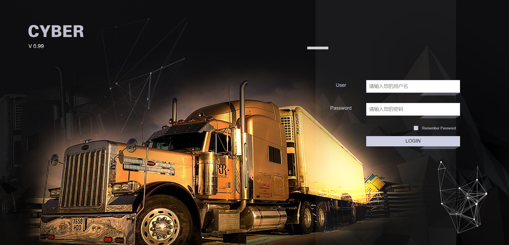

# E8项目前端文档说明开始

我是chapter1下的README.md文件，我相当于就是一个引导页，点击[http://localhost:8080/index/](http://localhost:8080/index/)页面的`开始阅读文档 →`就可以到本页面了

## 后台登录界面

> 这里我们可以有一个公司后台系统登录界面的图片

- 正式网站地址[你可以点这里](https://cyber.chepass.com/)，账号密码可以向后端要
- 测试网站地址，使用visual studio打开项目后运行项目后输入测试账号与密码
## 测试账号密码
- 测试账号：Admin
- 测试密码：123456

[点击这里快去看正式说明文档的内容吧 →](../chapter1/install.html)