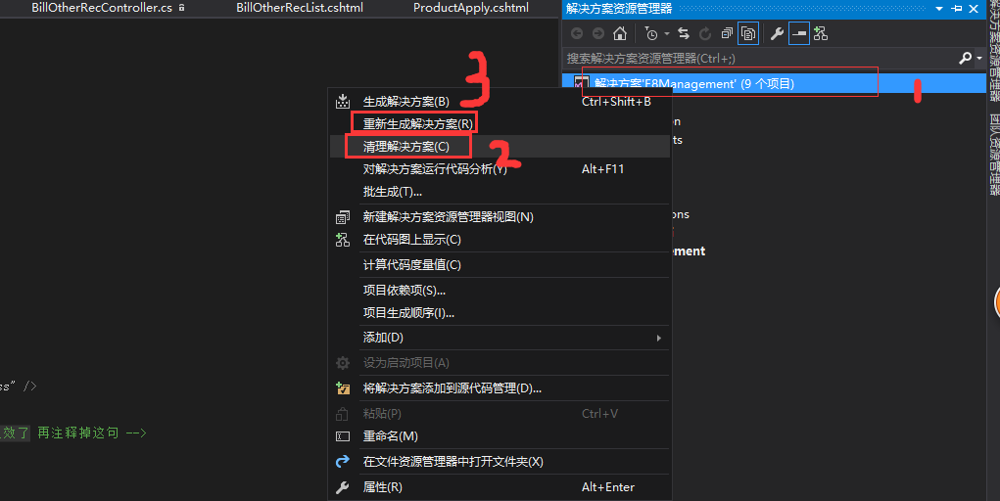

# 如何开始正式的干活
干活之前肯定是先找到项目的代码

## SVN获取代码

向后端申请开通一个svn账号，得到源代码地址后，输入账号密码拉去代码到本地

## visual studio打开项目
- 打开方式1

`文件`->`打开`-> `网站`->选择要打开的项目文件夹

- 打开方式2

打开visual studio 编辑器后左侧有个`最近`选项，直接点击最近打开过的项目

## 如何把项目正常的运行起来

在编辑器右侧`解决方案资源管理`面板，选择`解决方案`右键，出现 `清理解决方案`与`重新生成解决方案` 

注意先`清理`后`解决`

然后随便打开一个.cshtml页面， 按F5或者点击运行程序标识，稍微等待一会，浏览器会自动打开运行的页面

## 获取后端提交的代码

后端修改了提交了最新的接口代码，为了第一时间拿到最新的数据，先暂停调试模式，更新代码后重新生成解决方案，重新运行项目即可
