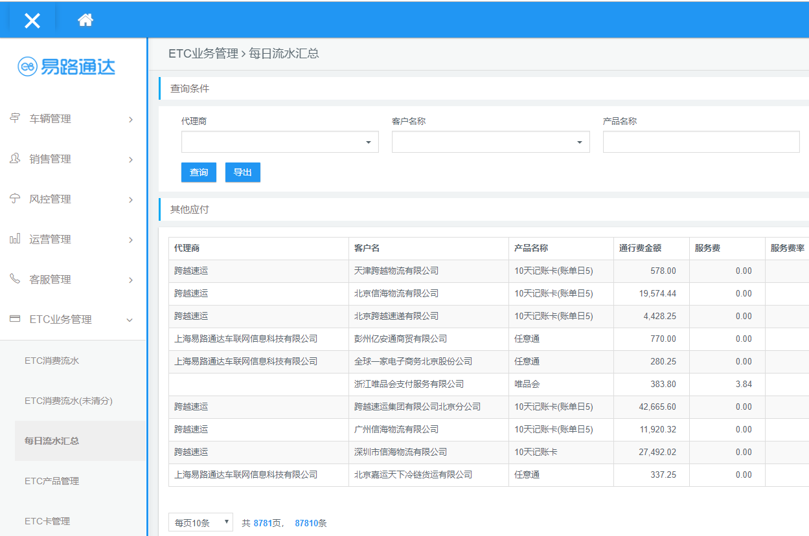
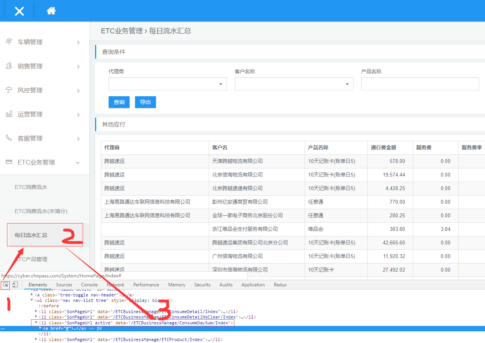

# 如何快速找到当前页面对应的文件

## 项目文件目录介绍
- 文件目录截图如下

- 这个项目对于前端只需要知道2个文件目录就行了，他们分别是`Areas`与`content`

`Areas`下是以.cshtml后缀的文件模板，该模板完全支持html，css,js，我们的静态页面就是嵌在里面的

`content`下面是我们的静态css、js文件，一些通用样式、js组件库，公共方法都在这里

## 示例页面

- 以每日流水页面为例

- f12打开控制台，查看做成菜单对应的url地址定位到文件

通过以上3个步骤找到该页面文件目录`/ETCBusinessManage/ConsumeDaySum/Index`

每日流水页面的代码文件就在`Areas`目录下的`/ETCBusinessManage/ConsumeDaySum/Views/`下的`Index.cshtml`

## 如何快速找到这个页面中使用了哪些js

- f12打开控制台 切换到Sources面板

