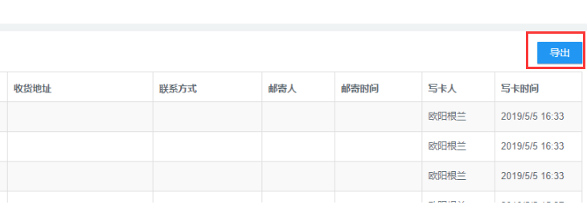

# UI界面1

## UI界面预览
每个页面的UI界面基本上都是这几个部分组成，如下图


- 左侧导航
- 内页导航位置
- 小标题
- 查询条件框
- 按钮
- 表格
## 左侧导航

通过后端直接配置字段即可生成对应菜单

## 内页导航位置
```html
<div class="panel box-shadow-none content-header">
      <div class="panel-body">
          <div class="col-md-12">
              <h4 class="animated fadeInLeft" style="margin:0px;margin-top:5px; padding:0px;"><span>销售管理</span> <span class="fa-angle-right fa"></span> <span>企业客户产品额度申请</span></h4>
          </div>
      </div>
  </div>
```
## 小标题

```html
<div class="my-title1">查询条件</div>
```
## 查询条件框
```html
 <div class="panel-body bg-white">
        <table style="width:100%">
            <tr class="row">
                <td class="col-md-6">
                    <label class="control-label">客户名称</label>
                    <div class="form-group">
                        <input type="text" class="form-control" id="CustomerName">
                    </div>
                </td>
                <td class="col-md-6">
                    <label class="control-label" for="Name">所属集团</label>
                    <div class="form-group">
                        <input type="text" class="form-control" id="CustomerName2">
                    </div>
                </td>
            </tr>
            <tr>
                <td colspan="3">
                    <input type="button" class="btn btn-primary" value="查询" id="selData">
                    <input type="button" class="btn btn-primary" value="导出" id="outPut" style="margin-left:20px;">
                </td>
            </tr>
        </table>
    </div>
```
## 按钮
```html
<input type="button" class="btn btn-primary" value="查询" id="selData">
```
## 表格与翻页
```html
 <div class="col-md-12 mt10">
      <div class="panel">
          <div class="panel-body">
              <div class="responsive-table" style="width:100%;overflow:auto;">
                  <table class="table table-striped table-bordered" cellspacing="0">
                      <thead>
                          <tr>
                              <th style="min-width:80px;">ID</th>
                              <th style="min-width:150px;">客户名称</th>
                              <th style="min-width:100px;">所属代理商</th>
                              <th style="min-width:100px;">所属集团</th>
                              <th style="min-width:100px;">客户额度</th>

                              <th style="min-width:100px;"> 集团额度</th>
                              <th style="min-width:100px;">客户已使用额度</th>
                              <th style="min-width:100px;">集团已使用额度</th>
                              <th style="min-width:100px;">客户额度使用率</th>
                              <th style="min-width:100px;">集团额度使用率</th>
                          </tr>
                      </thead>
                      <tbody>
                          <tr class="Js_tableDataList">
                              <td>{Id}</td>
                              <td>{BillType}</td>
                              <td>{Name}</td>
                              <td>{FinanceType}</td>
                              <td>{PayMoney}</td>
                              <td>{PayMoney}</td>
                              <td>{PayMoney}</td>
                              <td class="blue">{PayMoney}</td>
                              <td class="red">{PayMoney}</td>
                              <td>{CreateTime}</td>
                          </tr>
                      </tbody>
                  </table>
              </div>
              <div class="col-md-12">
                  <ul class="pagination pull-right">
                      <li class="list_page_box">
                          <div class="" style="position:absolute;left:0px;top:20px;">
                              <select style="width:100px;padding:5px;margin-right:10px;" id="exchangePageSize">
                                  <option value="10">每页10条</option>
                                  <option value="20">每页20条</option>
                                  <option value="30">每页30条</option>
                                  <option value="40">每页40条</option>
                                  <option value="50">每页50条</option>
                              </select>
                              共<a href="javascript:void(0)" class="pagCount" style="margin-left:5px;"></a>页，
                              <a href="javascript:void(0)" class="js_RecCount" style="margin-left:5px;"></a>条
                          </div>
                          <a href="javascript:void(0)" class="pagFirst">首页</a>
                          <a href="javascript:void(0)" class="pagPre"><span aria-hidden="true">&laquo;</span></a>
                          <a href="javascript:void(0)" class="pagNum active">1</a>
                          <a href="javascript:void(0)" class="pagNext"><span aria-hidden="true">&raquo;</span></a>
                          <a href="javascript:void(0)" class="pagLast"><span aria-hidden="true">尾页</span></a>
                      </li>
                  </ul>
              </div>
          </div>
      </div>
  </div>
```
## 表格右上角固定按钮
如下图


html代码
```html
<div class="table-title-btn-wrap">
    <div class="table-title-btn-box"><input type="button" class="btn btn-primary" value="导出" id="outPut" style="margin-left:20px;"></div>
</div>
 <table class="table table-striped table-bordered" cellspacing="0"></table>
```
