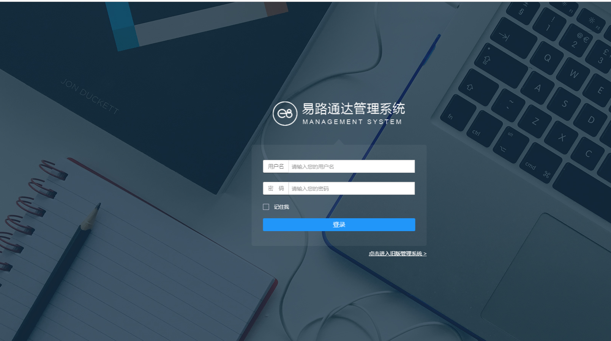

# 客户端后台系统
 打开visual studio2015编辑 最近打开的项目中选择 CustomerManage

或者选择项目文件的形式打开 `E:\myWork\Allpro\trunk\CustomerManage`

 ## 特别说明
 整体功能代码跟C端几乎一模一样，具体功能略微不同。代码就是从C端的copy出来换了一种登录背景图片而已

## 登录界面
 

 - 账号 Admin
 - 密码 123456

 ## 其他
 其他操作请参考C端