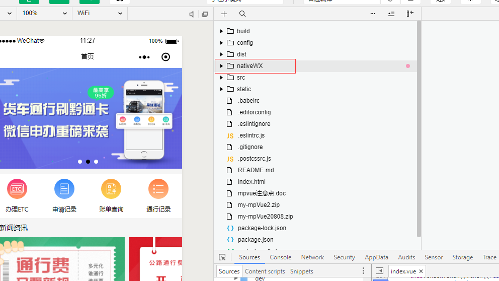

## 如何打开项目
打开桌面微信web开发者工具，输入AppID或者AppSecre，选择打开项目mpvue2。如何找不到最近打开项目，选择打开项目，目录路径E:\Alldemo\my-mpVue2

## 如何获取开发者权限

向运营人员获取公司微信公众号的登录账号与密码，把自己的微信号添加为开发者账号

## 项目结构说明
该项目是mpvue与原生微信小程序混合开发的，一半原生一半mpvue，原生项目文件夹nativeWX作为mpvue的子项目跟src文件夹并列。

- **nativeWX文件夹目录**

 

## 项目运行起来
mpvue部分代码可以选择你喜欢的编辑器开发，运行项目请看packjson.json中的配置 npm run dev

### 主要技术点
- 类vue开发框架，熟悉一些写法，大部分跟vue一样,个别vue语法不支持,需要原生小程序语法
- async await同步的方式书写异步
- vuex 状态管理

## 最后
该项目还没有上线，上线需要接口使用https协议，由于接口使用的是微信端的接口，而微信端接口没有申请开通https，所以导致小程序项目暂时无法上架。

